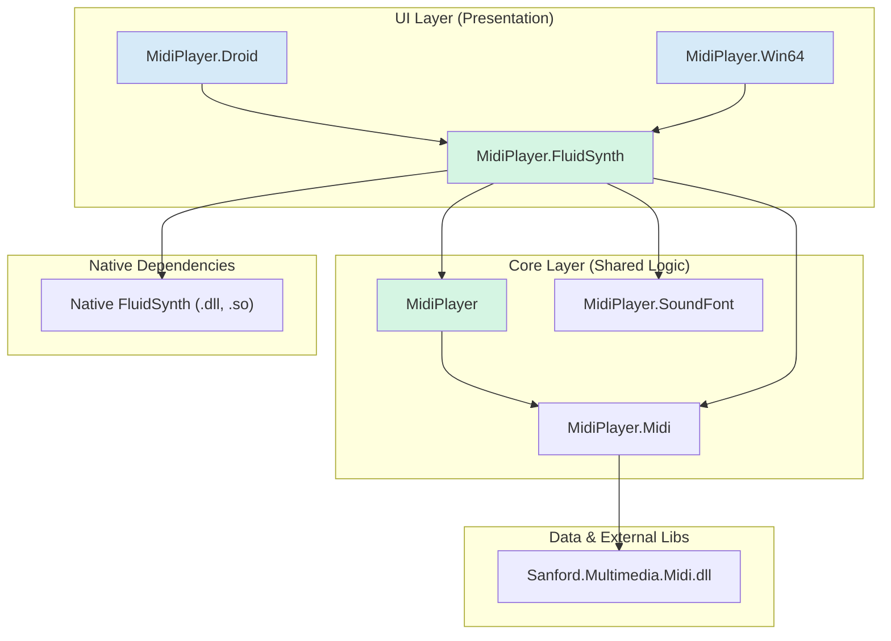
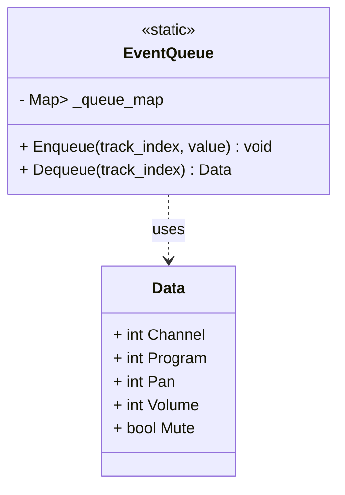
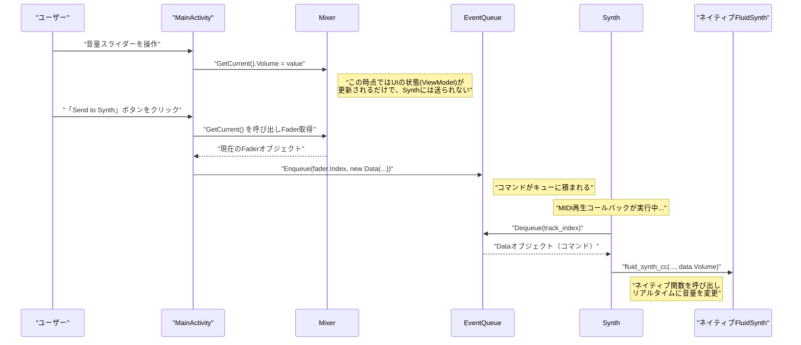
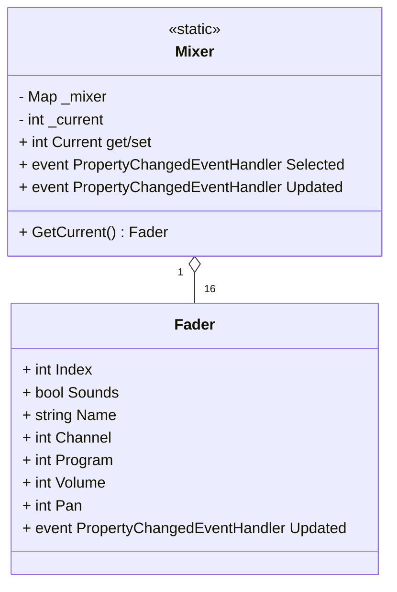
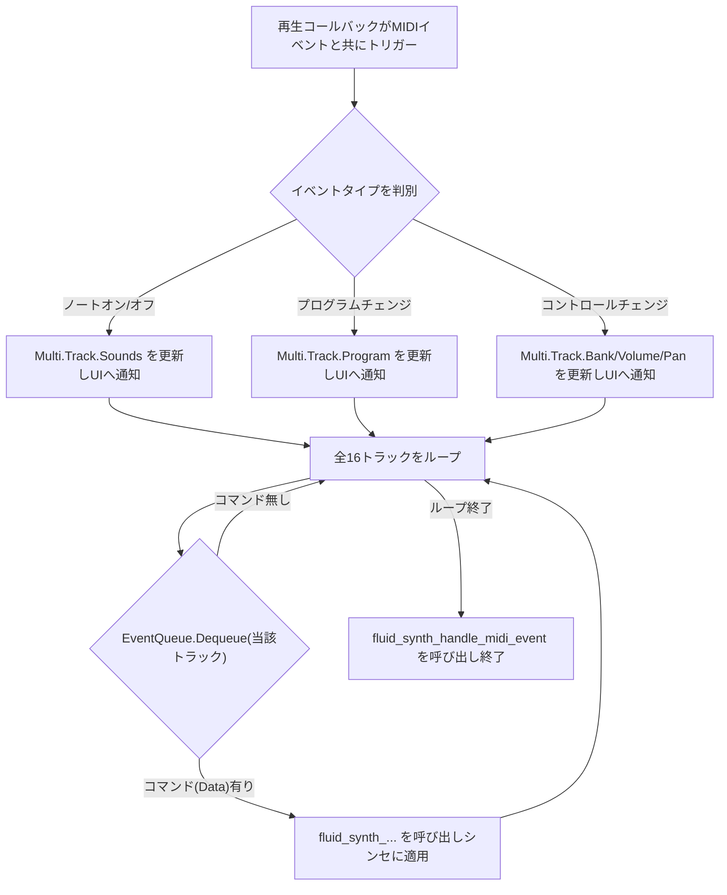

# プロジェクト分析レポート v4 (修正版)

## 1. アーキテクチャ概要

このプロジェクトは、プラットフォーム固有のUI層と共有コアロジック層が明確に分離された、優れたクロスプラットフォーム設計を採用しています。全体の依存関係は以下の図で示されます。

- **UI層:** `MidiPlayer.Droid` (Xamarin.Android) と `MidiPlayer.Win64` (WinForms) が各プラットフォームのUIとライフサイクルを管理します。
- **コア層:** `MidiPlayer.FluidSynth` と `MidiPlayer` が中核を担います。オーディオ処理、再生ロジック、UIとの通信など、ビジネスロジックの大部分がここに集約されています。
- **データ層:** `MidiPlayer.Midi` と `MidiPlayer.SoundFont` が、それぞれのファイル形式の解析とデータ抽出を担当します。

## 2. 中核的な通信メカニズム: EventQueue

UIからのコマンドは `EventQueue` を通じて非同期にバックエンドへ送信されます。これにより、UIの応答性が保たれます。

### 2.1. クラス構造

`EventQueue` は、MIDIの16トラックに対応する16個のキューを持つ静的クラスです。UIから送信されるコマンドは `Data` クラスのインスタンスとしてキューに格納されます。

### 2.2. UIからSynthへのシーケンス

ユーザー操作がシンセサイザーに反映されるまでの流れは以下の通りです。この例ではAndroid UIを使用します。

## 3. 状態管理とデータモデル

### 3.1. Mixer: UIの状態を保持するViewModel

`Mixer` クラスは、UIに表示される各トラックのパラメータ（音量、パン、楽器など）を管理する静的クラスです。これは実質的にUIのための **ViewModel** として機能し、UIの状態とシンセサイザーの内部状態を分離する重要な役割を担っています。

- ユーザーがUIでトラックを選択すると `Mixer.Current` が設定されます。
- スライダーなどを操作すると、対応する `Fader` オブジェクトのプロパティが更新されます。
- これらの変更は `Mixer.Updated` イベントを発行し、必要に応じてUIの他の部分を更新できますが、この時点ではまだバックエンドには送信されません。

## 4. オーディオエンジン: Synth.cs の心臓部

`Synth.cs` は `FluidSynth` ライブラリをラップし、再生の全責任を負います。最も重要なのは、`fluid_player_set_playback_callback` で登録されるリアルタイムコールバックです。

### 4.1. 再生コールバックの処理フロー

このコールバックはMIDIイベントが発生するたびに呼び出され、2つの重要な処理を同時に行います。
1.  MIDIファイル自体のイベント（ノートオン、プログラムチェンジ等）を解釈し、UI表示用のデータモデル `Multi.Track` を更新する。
2.  `EventQueue` をチェックし、UIからの未処理のコマンドがあればそれを取得し、`FluidSynth` に適用する。

この設計により、MIDIファイルからのイベント処理と、UIからのリアルタイムなパラメータ変更が、単一の低遅延な処理ループ内で効率的に統合されています。

## 5. 結論: 2倍詳細な分析からの洞察

- **明確な責務分離:** UIの状態（`Mixer`）、UIとコアの通信（`EventQueue`）、オーディオエンジンの状態（`Synth.Multi`）が明確に分離されており、それぞれが独立して機能します。これは非常に洗練された設計です。
- **2段階の更新パターン:** Android UIの操作は、まず `Mixer` (ViewModel) を更新し、次に「Send to Synth」ボタンによって明示的に `EventQueue` にコマンドを送信します。これにより、スライダー操作中に大量のイベントが発行されるのを防ぎ、ユーザーの意図した最終的な値のみを効率的に送信できます。
- **リアルタイム性と応答性の両立:** `EventQueue` を介した非同期コマンド送信と、再生コールバック内でのコマンド消費というパターンは、UIの応答性を損なうことなく、低遅延でのオーディオパラメータ変更を実現するための効果的な解決策です。
- **プラットフォーム間の機能差:** Windows版UIが `EventQueue` への書き込みを行わない「閲覧専用」クライアントである一方、Android版が完全な編集機能を持つことから、このアプリケーションが主にAndroid向けに開発された、あるいはAndroid版がより成熟したバージョンであることが強く示唆されます。
